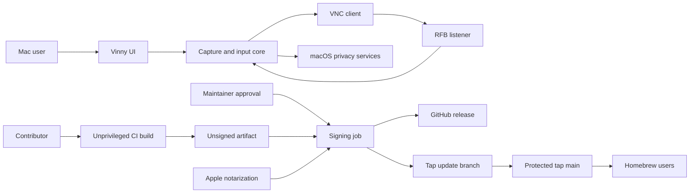

# Vinny threat model

## Executive summary

Vinny deliberately grants remote viewers access to screen contents and macOS input, so any reachable unsecured VNC listener is a high-value control surface. Vinny offers optional password-authenticated VeNCrypt/X.509 TLS, but defaults to plaintext loopback for compatibility. The other principal risk is release supply-chain compromise: a malicious maintainer session or workflow change could sign hostile code or alter the Homebrew tap. Existing controls are strong for a solo-maintainer project—loopback defaults, explicit warnings, protected branches/tags, SHA-pinned Actions, credential-free compilation, a manually approved release environment, Developer ID signing, and notarization—but they cannot compensate for direct Internet exposure or compromise of the sole administrator account.

## Scope and assumptions

- In scope: `src/`, `vendor/rustvncserver/`, `vendor/rfb-encodings/`, `scripts/`, `.github/workflows/`, `Info.plist`, `Cargo.toml`, the static `website/`, and Vinny's cask/update path in `sarimabbas/homebrew-tap`.
- Runtime model: a native macOS menu-bar app captures configured displays and accepts standard RFB/VNC clients; it injects keyboard and pointer events after macOS grants Screen Recording and Accessibility permissions.
- Network exposure is user-controlled. Loopback is the default, but users may choose LAN, overlay-network, wildcard, or public addresses.
- Servers default to unauthenticated plaintext loopback. Users may enable password-authenticated VeNCrypt/X509Plain over TLS; direct public-Internet exposure remains unsupported.
- GitHub and Apple hosted services, the macOS security model, the runner images, and Homebrew itself are external trust dependencies.
- Only the latest Vinny release receives security fixes (`docs/SECURITY.md`).

Open questions that could change risk: whether encrypted mode should become the default, whether stable user-managed certificates should replace per-server self-signed identities, and whether the tap will eventually require fully automatic merges rather than a human-reviewed cask pull request.

## System model

### Primary components

- **SwiftUI configuration app:** stores server configuration in `UserDefaults`, requests permissions, and invokes the Rust FFI (`src/VinnyUI.swift`, `VinnyModel`).
- **Capture and input process:** ScreenCaptureKit supplies frames; Enigo injects keyboard and pointer events (`src/capture.rs`; `src/input.rs`).
- **RFB listeners:** Tokio listeners parse client messages and serve framebuffers over plaintext RFB or password-authenticated VeNCrypt/X.509 TLS (`src/main.rs`, `serve`; `vendor/rustvncserver/src/server.rs`, `listen_on`; `vendor/rustvncserver/src/client.rs`, `handle_messages`).
- **Release pipeline:** GitHub Actions builds without secrets, then a manually approved job signs, notarizes, publishes, and prepares a tap branch (`.github/workflows/release.yml`).
- **Distribution:** GitHub Releases hosts the notarized ZIP; the Homebrew tap pins its SHA-256 (`sarimabbas/homebrew-tap/Casks/vinny.rb`).
- **Website:** static Vite/Cloudflare assets with no server-side input surface (`website/src/main.js`; `website/wrangler.jsonc`).

### Data flows and trust boundaries

- **VNC client → Vinny listener:** RFB messages, clipboard data, and optional input cross TCP. Depending on configuration, the connection is either plaintext/unauthenticated or password-authenticated VeNCrypt/X.509 TLS. The server permits at most eight concurrent clients, limits handshakes to ten seconds, reaps completed tasks, and validates protocol fields and clipboard size (`vendor/rustvncserver/src/server.rs`; `vendor/rustvncserver/src/client.rs`).
- **Vinny → VNC client:** captured screen pixels cross the negotiated transport. Any admitted client receives sensitive screen content; view-only affects input, not viewing.
- **Vinny → macOS privacy services:** permission checks and requests use ScreenCapture and Accessibility APIs. macOS TCC and the stable signed bundle identity provide authorization (`src/permissions.rs`; `Info.plist`).
- **SwiftUI → Rust FFI:** locally configured addresses, ports, display indexes, dimensions, and FPS cross an in-process FFI boundary. Swift and Rust both validate most numeric bounds (`src/VinnyUI.swift`, `validate`; `src/main.rs`, `server_config`).
- **Public contribution → CI:** untrusted repository changes run on a hosted runner with read-only contents permission and no release environment (`.github/workflows/ci.yml`). There is no `pull_request_target` workflow.
- **Protected main → build artifact:** pinned Actions and locked Cargo dependencies produce an unsigned app without release secrets (`.github/workflows/release.yml`, `build`).
- **Unsigned artifact → signing job:** GitHub artifact storage carries the app into a manually approved environment. The job imports Apple credentials, signs and notarizes the app, then removes temporary key material (`.github/workflows/release.yml`, `sign-and-publish`).
- **Release job → Homebrew tap:** a repository-scoped SSH deploy key prepares a cask branch. Protected tap `main` requires a pull request; the embedded GitHub SSH host keys authenticate the server and are public, not credentials (`.github/workflows/release.yml`, `Prepare Homebrew cask update`).

#### Diagram

## Assets and security objectives

| Asset | Why it matters | Security objective (C/I/A) |
|---|---|---|
| Screen frames | May expose credentials, messages, documents, and personal data | C, I |
| Keyboard and pointer control | Enables actions with the logged-in user's authority | I, A |
| Developer ID private key and password | Can sign software as Vinny's registered developer | C, I |
| App Store Connect API private key | Can submit software for notarization within its role | C, I |
| Homebrew tap deploy key | Can prepare changes anywhere in a multi-package tap | C, I |
| Release tags, ZIPs, checksums, and cask | Determine what users install as Vinny | I, A |
| Repository workflows and protected `main` | Define which code receives credentials and signatures | I |
| Vinny availability | A listener or app crash interrupts remote access | A |
| User configuration | Determines exposure and selected displays | I |

## Attacker model

### Capabilities

- Read, clone, fork, analyze, and submit pull requests to both public repositories.
- Connect to a Vinny listener if the user binds it to an attacker-reachable interface.
- Send malformed, slow, concurrent, or high-rate RFB traffic and arbitrary keyboard/pointer events after connecting.
- Attempt dependency, maintainer-account, CI action, GitHub, Homebrew tap, or developer-endpoint compromise.
- Observe plaintext RFB traffic when positioned on its network path.

### Non-capabilities

- Repository visibility alone does not reveal GitHub environment secrets or private deploy keys.
- A fork pull request cannot access the protected release environment under the current workflow triggers.
- An unauthenticated Internet attacker cannot reach a loopback-only listener without another local forwarding or compromise path.
- A tap-only deploy key cannot push to the Vinny repository or access Apple credentials.
- Branch protection cannot protect against compromise of the sole repository administrator plus their release approval session.

## Entry points and attack surfaces

| Surface | How reached | Trust boundary | Notes | Evidence (repo path / symbol) |
|---|---|---|---|---|
| RFB TCP listener | Configured IP and port | Network → privileged app | Plaintext by default; optional VeNCrypt/TLS; configurable sharing policy | `src/main.rs`, `serve`; `vendor/rustvncserver/src/server.rs`, `listen_on` |
| RFB message parser | Client byte stream | Untrusted protocol → parser/state | Clipboard capped at 10 MiB; handshakes capped at 10 seconds | `vendor/rustvncserver/src/client.rs`, `handle_messages`; `vendor/rustvncserver/src/server.rs`, `handle_client` |
| Input injection | Key/pointer RFB messages | Network → macOS user session | Executes after Accessibility approval | `src/input.rs`, `handle_events` |
| Screen capture | Frame subscription | macOS display → remote client | Executes after Screen Recording approval | `src/capture.rs`; `src/permissions.rs` |
| GUI configuration | Local user input/UserDefaults | User configuration → listener | Numeric and duplicate endpoint validation | `src/VinnyUI.swift`, `validate`; `src/main.rs`, `server_config` |
| Pull requests | Public GitHub contribution | Untrusted source → CI | Read-only token; no release secrets | `.github/workflows/ci.yml` |
| Manual release | Protected `main` and approval | Maintainer/workflow → signing credentials | Workflow code can reference environment secrets after approval | `.github/workflows/release.yml` |
| Tap update | SSH deploy key | Vinny release → multi-package tap | Branch-only update; protected `main` requires PR | `.github/workflows/release.yml`; tap branch protection |
| Website | Public static HTTP | Browser → static assets | No dynamic input rendering or backend | `website/src/main.js` |

## Top abuse paths

1. An operator publicly binds a server without encrypted mode → attacker discovers the port → connects without credentials → reads the screen and sends input unless view-only mode is active.
2. A network observer reaches plaintext RFB traffic → captures or modifies screen and input traffic without interacting with Vinny.
3. An attacker occupies all eight client slots or sends expensive valid update requests → legitimate clients are temporarily rejected or Vinny consumes excess CPU/bandwidth.
4. A maintainer account is compromised → attacker merges a workflow/application change → approves the release environment → exfiltrates Apple credentials or publishes signed malware.
5. The tap deploy key is stolen → attacker prepares malicious changes across the multi-package tap → attempts to deceive the maintainer into merging a poisoned cask/formula.
6. A Rust crate, pinned Action commit, runner image, or Xcode toolchain is compromised → build emits a hostile unsigned app → approval causes it to be signed and notarized.
7. A user approves the ephemeral self-signed certificate without verifying the endpoint → an active attacker impersonates the server → captures the X509Plain password or session traffic.

## Threat model table

| Threat ID | Threat source | Prerequisites | Threat action | Impact | Impacted assets | Existing controls (evidence) | Gaps | Recommended mitigations | Detection ideas | Likelihood | Impact severity | Priority |
|---|---|---|---|---|---|---|---|---|---|---|---|---|
| TM-001 | Remote client | Unsecured listener is reachable | Connect without authentication and view/control the Mac | Session compromise and sensitive-data disclosure | Screen, input, user session | Loopback default, warnings, optional VeNCrypt/X509Plain TLS, password in Keychain, view-only mode (`src/VinnyUI.swift`; `vendor/rustvncserver/src/client.rs`) | Plaintext mode remains available; no allowlist | Keep direct Internet exposure unsupported; prefer encrypted mode or a secure tunnel | Log remote address and connection lifecycle; expose active-client count | High when reachable; low on loopback | High | High |
| TM-002 | On-path network attacker | Attacker can observe a plaintext route or spoof an unverified self-signed endpoint | Capture/modify plaintext RFB or impersonate an encrypted server | Screen/keystroke disclosure, credential theft, and input manipulation | Screen, input, password | VeNCrypt/X509Plain TLS option and tunnel guidance (`docs/SECURITY.md`) | Plaintext remains available; generated certificates are self-signed and not pinned by Vinny | Verify certificate prompts; use a trusted tunnel for hostile networks | Document tunnel verification; log listener interface | Medium on shared networks | High | High |
| TM-003 | Remote client | Listener is reachable | Occupy all client slots or request updates at a high rate | Temporary rejection or excess CPU/bandwidth | Availability | Eight-client ceiling, 10-second handshake timeout, task cleanup, Rust memory safety, and 10 MiB clipboard cap (`vendor/rustvncserver/src/server.rs`; `vendor/rustvncserver/src/client.rs`) | No authenticated-session idle timeout or per-client rate limit | Add rate or idle limits only if real-world abuse warrants them | Connection counts, task counts, memory, file-descriptor pressure | Medium when public | Medium | Medium |
| TM-004 | Compromised maintainer/session | Control of the sole admin and approval session | Merge malicious workflow/code, approve release, steal keys or sign malware | Trusted supply-chain compromise | Apple keys, releases, users | Protected `main`, strict CI, manual environment, no admin bypass, secret-free build (`.github/workflows/release.yml`) | Same person controls merge and approval | Require hardware-backed 2FA; add a second trusted release reviewer when available; review the complete tag diff before approval | GitHub audit/security logs; Apple notarization history; alerts on workflow changes | Low to medium | High | High |
| TM-005 | Stolen tap deploy key | Secret exfiltration from release context or maintainer endpoint | Modify arbitrary tap branches and stage poisoned package updates | Multi-package distribution compromise if merged | Tap integrity, Homebrew users | Key is scoped to tap; tap `main` requires PR, admin enforcement, linear history, no force/deletion | Key is repository-wide and cannot be path-limited | Preserve human review; rotate on exposure; as tap grows, consider a dedicated GitHub App or per-package publication workflow | Alert on new branches/PRs and deploy-key use; review cask URL, signature, and checksum | Low | High | Medium |
| TM-006 | Supply-chain attacker | Compromise of dependency, pinned Action commit, runner, or toolchain | Inject code during build | Signed/notarized malicious release | Release integrity, users | `Cargo.lock`, Cargo checksums, exact Rust version, SHA-pinned Actions, isolated signing job (`Cargo.lock`; `rust-toolchain.toml`; workflows) | No Rust advisory check or provenance attestation | Add dependency advisory scanning; review Dependabot alerts; consider artifact attestations if adoption grows | Dependabot, GitHub dependency review, release diff review | Low | High | Medium |
| TM-007 | Maintainer error or compromised token | Ability to initiate publication | Replace a published binary without changing version | Tag-to-binary mismatch and silent update compromise | Release integrity | Protected tags; immutable workflow check and checksum publication (`.github/workflows/release.yml`) | GitHub administrators can still alter release metadata/assets manually | Never replace assets; issue a patch release; periodically verify release checksum against cask | Monitor release events and asset timestamps | Low | High | Medium |
| TM-008 | Remote client | Attempts unsupported or downgraded security negotiation | Select an unoffered security type or bypass VeNCrypt authentication | Authentication bypass or false assurance | Input/screen access | Strict offered-type checks; X509Plain occurs inside TLS; legacy DES implementation removed; regression tests cover negotiation (`vendor/rustvncserver/src/client.rs`) | No authentication rate limit; self-signed identity depends on viewer verification | Add authentication backoff if abuse appears; preserve strict negotiation and never restore bare VNCAuth | Authentication-failure and invalid-negotiation logs | Low | High | Medium |
| TM-009 | Malicious fork contributor | Ability to open PR | Modify CI code to seek credentials | CI abuse without secret access | CI resources | Read-only permissions, SHA pins, no `pull_request_target`, release environment only on manual `main` runs (`.github/workflows/ci.yml`) | Hosted runner minutes can still be consumed | Keep fork workflows credential-free; add workflow approval controls if abuse appears | Actions usage and anomalous workflow alerts | Low | Low | Low |
| TM-010 | Website visitor | Public site access | Attempt script injection through URL or interaction | Minimal; static site has no dynamic sink identified | Website visitors | Static assets and no `innerHTML`, `eval`, or backend input (`website/src/main.js`) | HTTP response headers are outside repository evidence | Configure standard security headers at hosting edge if supported | Browser CSP reports if a CSP is added | Low | Low | Low |

## Criticality calibration

- **Critical:** readily exploitable compromise at default settings or unrecoverable signing-key theft affecting all users. Examples: remote pre-auth code execution on loopback through a browser-accessible path; public disclosure of the Developer ID private key; automatic malicious cask merge without review.
- **High:** serious compromise requiring an explicit exposure choice or maintainer/account compromise. Examples: unauthenticated screen/input access on a reachable listener; plaintext RFB interception; connection-flood denial of service; signed-malware publication after admin compromise.
- **Medium:** meaningful supply-chain or security failure with additional controls/preconditions. Examples: a stolen tap key staging but not merging a change; future authentication negotiation bypass; compromised dependency surviving release review.
- **Low:** limited impact or no plausible privileged path. Examples: consuming fork CI minutes; disclosure of public application metadata, public SSH host keys, or secret names; attacks against the static website without an input sink.

The largest ranking variable is listener reachability. TM-001 through TM-003 move toward critical operational risk when a user exposes Vinny directly to the Internet; they are substantially reduced when Vinny stays on loopback behind an authenticated tunnel.

## Focus paths for security review

| Path | Why it matters | Related Threat IDs |
|---|---|---|
| `vendor/rustvncserver/src/client.rs` | Parses all untrusted RFB traffic and implements security negotiation | TM-001, TM-003, TM-008 |
| `vendor/rustvncserver/src/server.rs` | Enforces connection bounds and owns client-task lifecycle | TM-003 |
| `src/input.rs` | Converts remote messages into privileged local input | TM-001, TM-002 |
| `src/main.rs` | Applies transport/input policies and connects capture/input/listener lifecycles | TM-001, TM-002, TM-003, TM-008 |
| `src/capture.rs` | Handles sensitive frame buffers and display geometry | TM-001, TM-002 |
| `src/VinnyUI.swift` | Controls network exposure and communicates risk to users | TM-001, TM-002 |
| `src/permissions.rs` | Guards macOS capture and input capabilities | TM-001 |
| `.github/workflows/release.yml` | Receives all release credentials and controls publication | TM-004, TM-005, TM-006, TM-007 |
| `.github/workflows/ci.yml` | Executes untrusted contribution code | TM-009 |
| `scripts/package.sh` | Defines files copied and signed into the app bundle | TM-004, TM-006 |
| `build.rs` | Executes during builds and links the Swift object into the binary | TM-004, TM-006 |
| `Cargo.lock` | Pins third-party source inputs to releases | TM-006 |
| `Info.plist` | Declares identity and accurately communicates screen-capture use | TM-001 |
| `website/src/main.js` | Main browser execution surface | TM-010 |
| `sarimabbas/homebrew-tap/Casks/vinny.rb` | Determines the download and checksum installed by Homebrew | TM-005, TM-007 |
